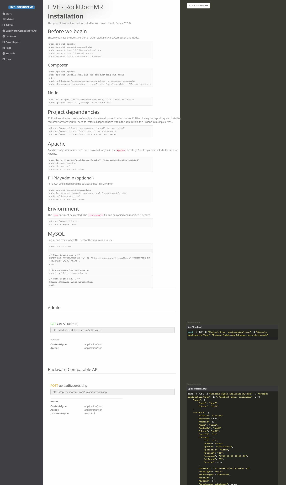

# Postmanerator Hu Theme
A split column theme for [Postmanerator](https://github.com/aubm/postmanerator) by Aurélien Baumann (aubm).

This theme has been updated to support the [v0.8.0](https://github.com/aubm/postmanerator/releases/tag/v0.8.0) release of Postmanerator.

## Table of Contents

* [Running](#running)
* [Preview](#preview)

## Running
```sh
postmanerator -output="/tmp/doc.html"" -collection="collection.json" -theme=hu
```
You can print directly from the served html.

## Preview

